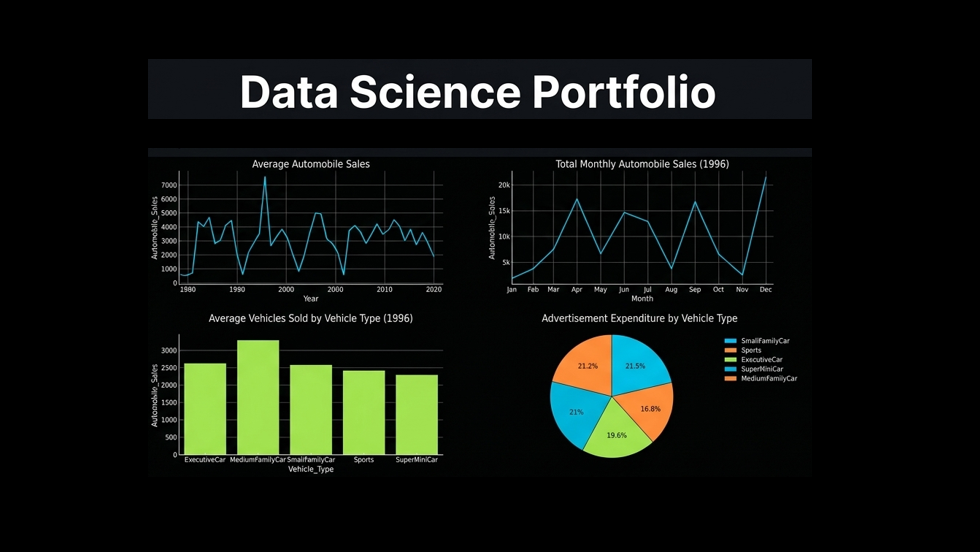

# 👋 Hi, I'm Roberto Castro 

**Data Science | Python, SQL, Machine Learning | EDA, Model Evaluation, Predictive Modeling**

IT professional transitioning into data science, applying Python, SQL, and machine learning to real-world datasets through end-to-end projects focused on analysis, modeling, and evaluation.  

Currently 66% through the IBM Data Science Professional Certificate, building hands-on experience in predictive modeling, model evaluation, and data-driven problem solving.

## 🚀 My Professional Progress
- 📊 **Current Milestone:** 8 / 12 Courses (*Currently taking Machine Learning with Python: KNN, Decision Trees, & Model Optimization*)
- 🔭 **Technical Focus:** Regression Modeling, EDA, Model Evaluation, Machine Learning Pipelines
- 🔍 **Core Toolkit:** Python (Pandas, scikit-learn), SQL, Plotly/Dash, Git/GitHub

---
## 📁 Featured Projects

### 🚗 Automobile Sales Dashboard (Plotly Dash)
Interactive dashboard analyzing 30+ years of automotive sales data, enabling dynamic exploration of recession impacts, vehicle-type trends, and macroeconomic market behavior. Implemented using Plotly Dash with dynamic callbacks for real-time data filtering and visualization.  
[View Project](https://github.com/rcastro-ai/Data-Science-Portfolio-IBM-Professional-Certificate-Projects/blob/main/08-Data-Visualization-with-Python/Automobile-Sales-Part-2.py) | [View Live Dashboard](https://rcastro.pythonanywhere.com/)

### 📊 House Price Prediction Model
Built and evaluated regression models using cross-validation, Ridge regression, and feature engineering to improve pricing accuracy and reduce overfitting.  
[View Project](https://github.com/rcastro-ai/Data-Science-Portfolio-IBM-Professional-Certificate-Projects/blob/main/07-Data-Analysis-with-Python/Model-Evaluation-and-Refinement-House-Pricing.ipynb)

### 📡 Telecom Customer Classification (KNN)
Developed a classification model with feature scaling and hyperparameter tuning to optimize customer segmentation predictions.  
[View Project](https://github.com/rcastro-ai/Data-Science-Portfolio-IBM-Professional-Certificate-Projects/blob/main/09-Machine-Learning-with-Python/telecom-customer-classification-with-knn.ipynb)

🔗 **Full Portfolio:**
[Data Science Portfolio Repository](https://github.com/rcastro-ai/Data-Science-Portfolio-IBM-Professional-Certificate-Projects)  
*End-to-end data science portfolio featuring real-world projects in data wrangling, exploratory data analysis, regression modeling, and model evaluation.*

  

## 📫 Connect with me
 
